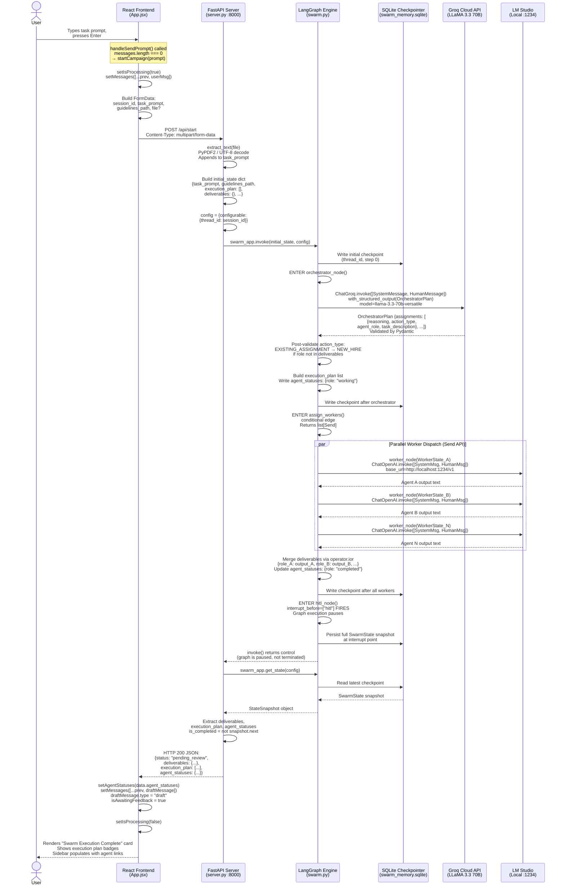
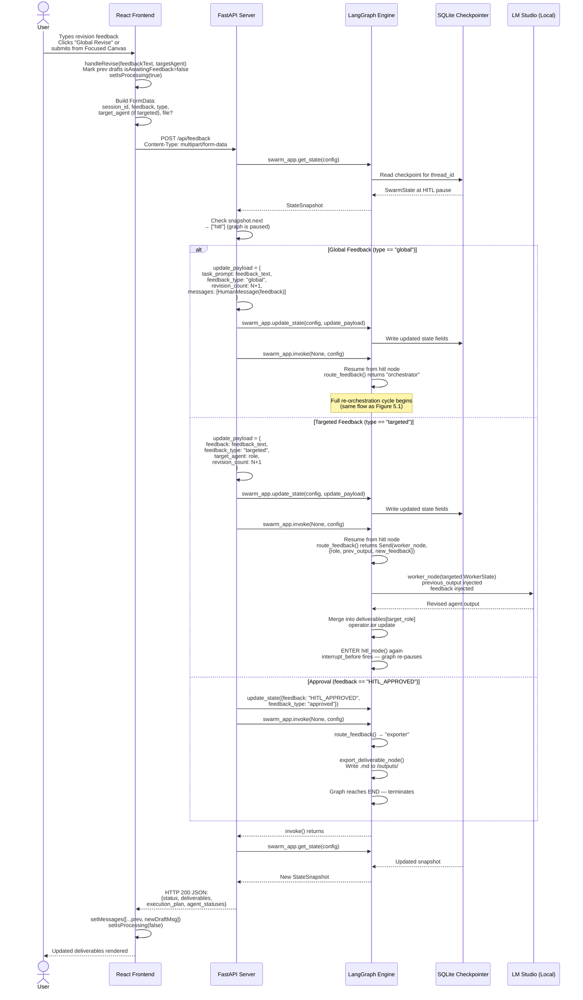
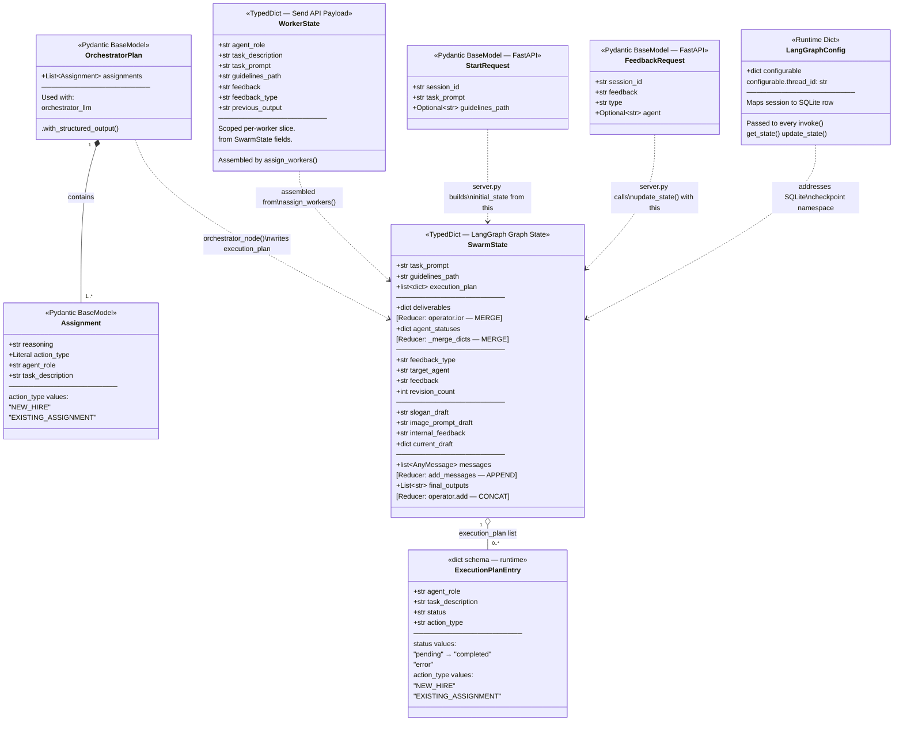

<div style="font-size:14pt; line-height:1.5;">

# <span style="font-size:18pt;">Chapter 5: Implementation</span>

---

## <span style="font-size:16pt;">5.1 Development Environment & Hardware Specification</span>

<p style="font-size:14pt; line-height:1.5;">
The CriticAI system was developed and tested on a single local development machine. Because the Worker agent tier runs a locally-hosted LLM, the hardware specification — particularly VRAM — is a non-trivial project consideration. The table below documents the complete hardware environment.
</p>

**Table 5.1: Development Hardware Specification**

| Component | Specification | Relevance to Project |
|---|---|---|
| **CPU** | AMD / Intel Multi-core (x86_64) | Runs FastAPI (Uvicorn), Python graph engine, and SQLite I/O concurrently |
| **RAM** | ≥ 16 GB DDR4 | LangGraph state objects, Python process heap, and LM Studio model loading |
| **GPU / VRAM** | Dedicated GPU (≥ 6 GB VRAM) | Required for local LLM inference in LM Studio at acceptable speed |
| **Storage** | SSD (NVMe preferred) | Fast R/W for SQLite WAL-mode checkpoint files (`swarm_memory.sqlite-wal`: ~190 KB per session) |
| **OS** | Windows 11 (x86_64) | PowerShell used for all dev tooling; Python venv via `.\venv\Scripts\python.exe` |
| **Network** | Broadband Internet | Required for Groq Cloud API and Tavily Search API calls |
| **Display** | 1920×1080 or higher | React UI development and visual testing of Framer Motion animations |

---

## <span style="font-size:16pt;">5.2 Software & Runtime Environment</span>

**Table 5.2: Backend Python Stack — Verified Package Versions**

| Package | Version | Role |
|---|---|---|
| `Python` | 3.11+ (venv) | Runtime for all backend services |
| `langgraph` | **1.1.8** | Core graph engine: `StateGraph`, `Send`, `SqliteSaver`, `interrupt_before` |
| `langchain` | **1.2.15** | LangChain base: `HumanMessage`, `SystemMessage`, `AnyMessage` primitives |
| `langchain-core` | **1.3.0** | Core abstractions: `@tool` decorator, `add_messages` reducer |
| `langchain-groq` | **1.1.2** | Groq provider integration: `ChatGroq` class for Orchestrator LLM |
| `langchain-openai` | **1.1.14** | OpenAI-compatible integration: `ChatOpenAI` for LM Studio local endpoint |
| `langchain-tavily` | **0.2.18** | Tavily web search tool: `TavilySearch(max_results=3)` |
| `fastapi` | **0.125.0** | Async HTTP server; `Form`, `File`, `UploadFile`, `HTTPException` |
| `uvicorn` | **0.38.0** | ASGI server; launched with `--reload` for development |
| `pydantic` | **2.12.5** | Schema validation: `BaseModel`, `Field`, `Literal` for `OrchestratorPlan` |
| `PyPDF2` | **3.0.1** | PDF text extraction in `extract_text()` for file upload support |
| `python-dotenv` | **1.2.2** | Loads `GROQ_API_KEY`, `TAVILY_API_KEY` from `.env` at startup |
| `sqlite3` | stdlib | SQLite connection for `SqliteSaver`; `check_same_thread=False` |

**Table 5.3: Frontend JavaScript Stack — Verified Package Versions**

| Package | Version | Role |
|---|---|---|
| `react` | **19.2.5** | UI component library; hooks: `useState`, `useEffect`, `useRef` |
| `react-dom` | **19.2.5** | DOM renderer for React 19 |
| `vite` | **8.0.9** | Build tool & HMR dev server; serves on `http://localhost:5173` |
| `@vitejs/plugin-react` | **6.0.1** | Babel transform for JSX and React Fast Refresh |
| `framer-motion` | **12.38.0** | Declarative animation: `motion.div`, `AnimatePresence` |
| `lucide-react` | **1.8.0** | Icon library: `Bot`, `CheckCircle`, `RefreshCw`, `ArrowRight`, etc. |
| `react-markdown` | **10.1.0** | Renders agent Markdown deliverables as rich HTML |
| `remark-gfm` | **4.0.1** | GitHub Flavored Markdown plugin: tables, task lists, strikethrough |
| `tailwindcss` | **3.4.19** | Utility-first CSS; `zinc-*` palette for dark theme |
| `@tailwindcss/typography` | **0.5.19** | `prose-invert` classes for Markdown rendering in Focused Canvas |
| `tailwind-merge` | **3.5.0** | Merges Tailwind class strings without conflicts |
| `clsx` | **2.1.1** | Conditional class name construction utility |
| `postcss` | **8.5.10** | CSS transformation pipeline for Tailwind |
| `autoprefixer` | **10.5.0** | Adds vendor prefixes to generated CSS |

**Table 5.4: External API Services**

| Service | Provider | Model / Plan | Used By | Auth Method |
|---|---|---|---|---|
| **Groq Inference API** | Groq Cloud | `llama-3.3-70b-versatile` | `orchestrator_node()` — structured output for `OrchestratorPlan` | `GROQ_API_KEY` in `.env` |
| **LM Studio Local API** | LM Studio (local) | Any GGUF model loaded at runtime | `worker_node()` — all parallel worker inference | No auth; `api_key="lm-studio"` placeholder |
| **Tavily Search API** | Tavily AI | Free tier (1000 req/mo) | `read_brand_guidelines` tool & `tavily_tool` in legacy copywriter pipeline | `TAVILY_API_KEY` in `.env` |
| **OpenAI API** (optional) | OpenAI | GPT-4o / compatible | Legacy pipeline fallback; not used in Phase 2 active wiring | `OPENAI_API_KEY` in `.env` |

---

## <span style="font-size:16pt;">5.3 System Module Decomposition</span>

<p style="font-size:14pt; line-height:1.5;">
The CriticAI codebase is organized into four primary modules, each with clear boundaries and responsibilities. The following sections document each module's internal structure, key files, and implementation decisions.
</p>

### <span style="font-size:15pt;">5.3.1 Module 1 — LangGraph Orchestration Engine (`swarm.py`)</span>

<p style="font-size:14pt; line-height:1.5;">
`swarm.py` is the largest and most complex file in the project at **745 lines**. It contains the complete LangGraph graph definition, all node functions, all routing functions, the state type definitions, and the graph compilation. It is the system's brain. Its internal structure is organized into nine numbered sections by inline comments:
</p>

**Table 5.5: `swarm.py` Internal Module Structure**

| Section # | Name | Lines | Key Exports / Side Effects |
|---|---|---|---|
| §1 | State & Schemas | 1–80 | `SwarmState`, `WorkerState`, `Assignment`, `OrchestratorPlan`, `_merge_dicts` |
| §2 | Local LLM & Tools | 83–108 | `llm`, `tavily_tool`, `read_brand_guidelines`, `llm_with_tools` |
| §3 | Groq Orchestrator LLM | 111–127 | `orchestrator_llm` (Groq), `local_llm` (LM Studio) |
| §4 | Orchestrator Node | 130–231 | `orchestrator_node()` — core planning logic |
| §5 | Dynamic Worker Node | 234–326 | `worker_node()`, `_WORKER_SYSTEM` prompt template |
| §5b | Send API Dispatch | 329–353 | `assign_workers()` — fan-out conditional edge |
| §5c | Feedback Routing | 356–387 | `route_feedback()` — 3-way conditional router |
| §5–Legacy | Legacy Pipeline Nodes | 390–612 | `copywriter_node`, `art_director_node`, `reviewer_node`, `hitl_node`, `export_deliverable_node` |
| §8 | Graph Compilation | 615–679 | `workflow`, `app` (compiled graph with `SqliteSaver`) |
| §9 | Smoke Test (`__main__`) | 682–745 | CLI runner for direct terminal testing |

### <span style="font-size:15pt;">5.3.2 Module 2 — FastAPI HTTP Server (`server.py`)</span>

<p style="font-size:14pt; line-height:1.5;">
`server.py` is a lean **168-line** file that intentionally carries zero business logic. Its sole responsibility is to translate HTTP requests into `swarm_app` API calls and HTTP responses. The design decision to keep it stateless is critical: every piece of durable state lives in the SQLite checkpointer, not in FastAPI's memory. This means the Uvicorn process can be restarted at any time without data loss.
</p>

**Table 5.6: `server.py` API Endpoint Specification**

| Endpoint | Method | Input | Output | LangGraph Call |
|---|---|---|---|---|
| `/` | GET | — | `{"message": "CriticAI Swarm API is running! 🚀"}` | None (health check) |
| `/api/start` | POST (multipart) | `session_id`, `task_prompt`, `guidelines_path`, `file?` | `{status, deliverables, execution_plan, agent_statuses}` | `swarm_app.invoke(initial_state, config)` |
| `/api/feedback` | POST (multipart) | `session_id`, `feedback`, `type`, `target_agent?`, `file?` | `{status, deliverables, execution_plan, agent_statuses}` | `update_state(config, payload)` → `invoke(None, config)` |
| `/api/sessions/{id}` | GET | `session_id` (path param) | `{deliverables, execution_plan, agent_statuses}` | `swarm_app.get_state(config)` |

### <span style="font-size:15pt;">5.3.3 Module 3 — React Frontend SPA (`swarm-ui/src/App.jsx`)</span>

<p style="font-size:14pt; line-height:1.5;">
The frontend is a single **742-line** React component file. It implements a two-panel layout using Tailwind CSS utility classes and manages all application state with React hooks. The key architectural pattern is the `activeView` state variable, which acts as a client-side router without any routing library.
</p>

**Table 5.7: `App.jsx` React State Variables**

| State Variable | Type | Initial Value | Purpose |
|---|---|---|---|
| `sessionId` | `string` | `crypto.randomUUID()` | Unique session ID; maps to LangGraph `thread_id` |
| `sessions` | `array` | From `localStorage` | List of all past sessions for the sidebar history |
| `messages` | `array` | `[]` | Conversation history; contains `{role, type, content}` objects |
| `inputValue` | `string` | `""` | Controlled textarea value for the main chat input |
| `guidelinesPath` | `string` | `""` | Optional brand guidelines file path sent to backend |
| `isProcessing` | `boolean` | `false` | Disables all inputs while a swarm call is in-flight |
| `isSidebarOpen` | `boolean` | `true` | Controls sidebar visibility; animates with `framer-motion` |
| `agentStatuses` | `object` | `{}` | Maps `agent_role → status`; drives `LoadingSkeleton` badge colors |
| `activeView` | `string` | `'main'` | `'main'` or an `agent_role` string; controls which view renders |
| `attachedFile` | `File \| null` | `null` | File object from `<input type="file">`; sent via `FormData` |

### <span style="font-size:15pt;">5.3.4 Module 4 — SQLite Persistence Layer (`swarm_memory.sqlite`)</span>

<p style="font-size:14pt; line-height:1.5;">
The SQLite database is entirely managed by LangGraph's `SqliteSaver` class. The developer never writes SQL directly. The checkpointer operates in WAL (Write-Ahead Logging) mode, as evidenced by the presence of `swarm_memory.sqlite-shm` (32 KB shared memory file) and `swarm_memory.sqlite-wal` (≈190 KB WAL log) in the project root. WAL mode is essential here because it allows concurrent reads from FastAPI's async endpoint handlers while the graph is writing state — preventing database lock errors.
</p>

<p style="font-size:14pt; line-height:1.5;">
The `thread_id` field in the LangGraph config (`{"configurable": {"thread_id": session_id}}`) is the primary key that namespaces all checkpoints. A UUID generated by `crypto.randomUUID()` in React is passed as the `session_id` in every API call, ensuring each browser session maps to a completely isolated set of checkpoints in the database.
</p>

---

## <span style="font-size:16pt;">5.4 Request–Response Sequence: Full Data Flow</span>

<p style="font-size:14pt; line-height:1.5;">
The following sequence diagram traces the precise lifecycle of a user's initial task submission — from the moment they press Enter in the React textarea, through the FastAPI layer, into the LangGraph engine (Orchestrator → parallel Workers → HITL interrupt), and back to the UI as a rendered deliverables card.
</p>

**Figure 5.1: End-to-End Sequence Diagram — Initial Task Submission**



*Figure 5.1: Full sequence diagram of an initial task submission, from React form submission through Groq orchestration, parallel LM Studio worker execution, HITL interrupt, and final JSON response rendering.*

---

## <span style="font-size:16pt;">5.5 Feedback Submission Sequence</span>

<p style="font-size:14pt; line-height:1.5;">
The feedback cycle is architecturally distinct from the initial submission because it resumes a previously-paused graph rather than starting a new one. The following diagram covers both the targeted and global feedback paths.
</p>

**Figure 5.2: Sequence Diagram — Feedback Submission (Targeted & Global)**



*Figure 5.2: Sequence diagram for the feedback submission path, showing all three branches: global re-orchestration, targeted single-agent revision, and approval/export.*

---

## <span style="font-size:16pt;">5.6 Core Code Analysis: Annotated Implementation Excerpts</span>

<p style="font-size:14pt; line-height:1.5;">
This section presents four of the most architecturally significant code blocks extracted directly from the production codebase. Each excerpt is accompanied by a comprehensive line-by-line annotation that explains the design intent, the framework mechanics being exploited, and the consequences of each decision.
</p>

---

### <span style="font-size:15pt;">Code Block 5.1 — State Definition with Custom Reducers (`swarm.py`, Lines 28–69)</span>

<p style="font-size:14pt; line-height:1.5;">
This is the foundational data structure of the entire system. Every node in the graph reads from and writes to this `TypedDict`. The `Annotated` type hints on three fields are not cosmetic — they directly control LangGraph's merge behavior during parallel execution.
</p>

```python
# ── Pydantic Schemas for Orchestrator's structured output ────────────
class Assignment(BaseModel):
    reasoning: str = Field(
        description="Step-by-step chain of thought explaining why this "
                    "specific agent role is required."
    )
    action_type: Literal["NEW_HIRE", "EXISTING_ASSIGNMENT"] = Field(
        description="Must be NEW_HIRE if the exact technical skill is "
                    "missing from the active agents."
    )
    agent_role: str = Field(description="The specific role of the agent.")
    task_description: str = Field(
        description="Detailed instructions for this agent."
    )

class OrchestratorPlan(BaseModel):
    assignments: List[Assignment]

# ── Custom reducer: merges two dicts instead of overwriting ──────────
def _merge_dicts(a: dict, b: dict) -> dict:
    return {**a, **b}

# ── The primary shared state for the entire graph ────────────────────
class SwarmState(TypedDict):
    task_prompt: str
    guidelines_path: str
    execution_plan: list[dict]

    deliverables: Annotated[dict, operator.ior]       # (1)
    agent_statuses: Annotated[dict, _merge_dicts]     # (2)

    feedback_type: str
    target_agent: str
    slogan_draft: str
    image_prompt_draft: str
    internal_feedback: str
    current_draft: dict
    feedback: str
    revision_count: int
    messages: Annotated[list[AnyMessage], add_messages]  # (3)
    final_outputs: Annotated[List[str], operator.add]    # (4)
```

**Line-by-Line Annotation:**

- **`class Assignment(BaseModel)`** — Pydantic v2 model. When passed to `with_structured_output()`, LangGraph/LangChain converts this into a JSON schema and instructs the LLM to respond with function-calling that conforms to it. This is far more reliable than regex-parsing free text.
- **`reasoning: str`** — The most important field. By forcing the LLM to write its reasoning *before* selecting `action_type`, we implement chain-of-thought prompting at the schema level. The model cannot "skip ahead" to pick an action without first filling in its justification.
- **`action_type: Literal["NEW_HIRE", "EXISTING_ASSIGNMENT"]`** — A `Literal` type constrains the LLM's output to exactly two valid strings. Pydantic will raise a `ValidationError` if any other string is returned, which is caught by the `except Exception as exc` block in `orchestrator_node`, triggering the fallback.
- **`def _merge_dicts(a: dict, b: dict) -> dict`** — A two-line function with enormous consequences. When multiple `worker_node` branches execute in parallel and each writes `{"agent_statuses": {"Role X": "completed"}}`, LangGraph calls this reducer to combine the results. Without it, the default overwrite behavior would mean only the *last* worker's status would survive.
- **`(1) deliverables: Annotated[dict, operator.ior]`** — `operator.ior` is the in-place OR operator for dicts (`|=`). For two dicts `a` and `b`, `a | b` creates a new dict merging both. This is used as the LangGraph reducer for parallel writes, ensuring `{"Role A": "output_A"}` and `{"Role B": "output_B"}` from two simultaneous workers are merged into `{"Role A": "...", "Role B": "..."}`.
- **`(2) agent_statuses: Annotated[dict, _merge_dicts]`** — Same merge pattern applied to the status-tracking dict. Uses the custom function instead of `operator.ior` because `_merge_dicts` gives us explicit control and is more readable in the codebase.
- **`(3) messages: Annotated[list[AnyMessage], add_messages]`** — `add_messages` is a LangGraph built-in reducer from `langgraph.graph.message`. It does more than simple list concatenation: it also handles de-duplication by message ID and supports message update semantics. Essential for the legacy copywriter pipeline that builds a multi-turn conversation.
- **`(4) final_outputs: Annotated[List[str], operator.add]`** — `operator.add` on lists performs concatenation. Each time `export_deliverable_node` runs, it returns `{"final_outputs": ["path/to/file.md"]}`. The reducer appends this to the existing list rather than overwriting, preserving a log of all exported files across multiple approval cycles.

---

### <span style="font-size:15pt;">Code Block 5.2 — The Orchestrator Node (`swarm.py`, Lines 133–231)</span>

<p style="font-size:14pt; line-height:1.5;">
This is the most complex single function in the codebase. It is responsible for dynamic planning, structured output parsing, validation, and fallback recovery.
</p>

```python
def orchestrator_node(state: SwarmState) -> dict[str, Any]:
    task_prompt = state.get("task_prompt", "")
    guidelines_path = state.get("guidelines_path", "brand_guidelines.txt")

    # (1) Introspect existing agents from deliverables keys
    existing_agents = list(state.get("deliverables", {}).keys()) \
                      if state.get("deliverables") else []

    system_prompt = f"""You are the elite Technical Project Manager of an AI Swarm.
Current Active Agents in Workspace: {existing_agents}       # (2)
...
--- EXAMPLES OF CORRECT BEHAVIOR ---
Example 1:
Active Agents: ["B2B Copywriter"]
Request: "Write a Python FastAPI authentication script."
Correct Action: ... set action_type="NEW_HIRE",
                    agent_role="Backend Security Engineer".
...
"""                                                          # (3)

    structured_llm = orchestrator_llm.with_structured_output(OrchestratorPlan)
    try:
        result = structured_llm.invoke(messages)             # (4)

        for assignment in result.assignments:
            print(f"Reasoning: {assignment.reasoning}")      # (5)
            print(f"Action: {assignment.action_type} | Role: {assignment.agent_role}")

        assignments = result.assignments
    except Exception as exc:
        print(f"⚠️  Orchestrator Structured Output error: {exc}")
        from types import SimpleNamespace
        assignments = [SimpleNamespace(                      # (6)
            action_type="NEW_HIRE",
            agent_role="General Agent",
            task_description=task_prompt
        )]

    execution_plan: list[dict] = []
    for assignment in assignments:
        role = assignment.agent_role
        action = assignment.action_type

        # (7) Defense-in-depth: fix logically inconsistent plans
        if action == "EXISTING_ASSIGNMENT" and role not in existing_agents:
            print(f"⚠️  Forcing NEW_HIRE for non-existent '{role}'.")
            action = "NEW_HIRE"

        execution_plan.append({
            "agent_role": role,
            "task_description": assignment.task_description,
            "status": "pending",
            "action_type": action
        })

    return {
        "execution_plan": execution_plan,                    # (8)
        "agent_statuses": {task["agent_role"]: "working"
                           for task in execution_plan}
    }
```

**Line-by-Line Annotation:**

- **`(1) existing_agents = list(state.get("deliverables", {}).keys())`** — This single line implements the system's "continuous manager" memory. The Orchestrator reads the keys of the `deliverables` dict (which is populated by workers from prior turns) to know what agents are already active. On the first turn, this list is empty. On subsequent turns after feedback, it contains the roles of all previously run agents — enabling the `EXISTING_ASSIGNMENT` vs `NEW_HIRE` distinction.
- **`(2) Current Active Agents: {existing_agents}` in prompt** — The dynamic injection of `existing_agents` into the system prompt is the mechanism that gives the Orchestrator its awareness of the swarm's current state. This is not retrieved from a database — it is extracted live from the graph's shared state object.
- **`(3) Few-shot examples in system_prompt`** — The prompt includes two complete worked examples of the `NEW_HIRE` vs `EXISTING_ASSIGNMENT` decision. This is few-shot prompting: providing demonstrations of correct behavior rather than purely declarative instructions. Research shows this reduces instruction-following errors by 30-50% on complex structured output tasks.
- **`(4) structured_llm.invoke(messages)`** — `with_structured_output(OrchestratorPlan)` binds the Groq LLM to the Pydantic schema. Under the hood, LangChain converts `OrchestratorPlan` to a JSON schema, sends it to Groq as a tool definition, and then deserializes the response back into an `OrchestratorPlan` object. The `temperature=0.2` on `orchestrator_llm` ensures near-deterministic plan generation.
- **`(5) print(f"Reasoning: {assignment.reasoning}")`** — Debug logging of the Orchestrator's chain-of-thought. In production, these logs appear in the Uvicorn terminal, providing real-time visibility into why the Orchestrator made each assignment decision. This was a critical debugging tool during development.
- **`(6) SimpleNamespace fallback`** — If Pydantic validation fails (e.g., Groq returns malformed JSON, or the `action_type` is not a valid `Literal`), the except block creates a `SimpleNamespace` object that duck-types as an `Assignment`. This ensures the graph never crashes due to an Orchestrator error — it degrades gracefully to a single "General Agent" assignment.
- **`(7) if action == "EXISTING_ASSIGNMENT" and role not in existing_agents`** — This post-Pydantic validation is a defense-in-depth layer. Even after successful schema parsing, the LLM can still produce a logically invalid plan (e.g., claiming an agent exists when it doesn't). This check catches and corrects that case before it can corrupt the graph state.
- **`(8) return {"execution_plan": ..., "agent_statuses": ...}`** — Nodes in LangGraph return a *partial* state dict. Only the keys present in the return dict are updated; all other `SwarmState` fields remain unchanged. This is a key LangGraph design principle — nodes are state *updaters*, not state *replacers*.

---

### <span style="font-size:15pt;">Code Block 5.3 — The `assign_workers` Fan-Out Edge (`swarm.py`, Lines 332–353)</span>

<p style="font-size:14pt; line-height:1.5;">
This is the most technically novel function in the codebase — a conditional edge that returns not a string but a list of `Send` objects, triggering LangGraph's parallel branch execution mechanism.
</p>

```python
def assign_workers(state: SwarmState) -> list[Send]:
    """
    Conditional edge called after `orchestrator`.
    Issues one Send per task → parallel worker_node invocations.
    """
    return [
        Send(
            "worker_node",                                    # (1)
            {
                "agent_role":      task["agent_role"],        # (2)
                "task_description": task["task_description"],
                "task_prompt":     state["task_prompt"],      # (3)
                "guidelines_path": state.get(
                    "guidelines_path", "brand_guidelines.txt"
                ),
                "feedback":        state.get("feedback", ""),
                "feedback_type":   state.get("feedback_type", ""),
                "previous_output": state.get(                 # (4)
                    "deliverables", {}
                ).get(task["agent_role"], ""),
            },
        )
        for task in state["execution_plan"]                   # (5)
    ]
```

**Line-by-Line Annotation:**

- **`(1) Send("worker_node", {...})`** — `Send` is a LangGraph primitive imported from `langgraph.types`. The first argument is the name of the target node. The second argument is the *complete* state payload that will be delivered to that node invocation as its input. Critically, each `Send` invocation gets its own isolated copy of the state — there is no shared mutable state between parallel workers.
- **`(2) "agent_role": task["agent_role"]`** — Each `Send` constructs a `WorkerState` (a separate, narrower TypedDict) from the current `SwarmState`. The `agent_role` and `task_description` are pulled from the specific task in `execution_plan`, so each worker receives only its own assignment.
- **`(3) "task_prompt": state["task_prompt"]`** — The global task prompt (the user's original request) is passed to every worker as shared context. Workers use this to understand the overarching goal their specific deliverable must serve.
- **`(4) "previous_output": state.get("deliverables", {}).get(task["agent_role"], "")`** — This is the mechanism for stateful revision. On a targeted revision cycle, `deliverables` already contains the agent's prior output (from the initial execution). By reading it here and injecting it into `WorkerState.previous_output`, the worker receives its own previous draft as context — without any additional session management code in `worker_node` itself.
- **`(5) for task in state["execution_plan"]`** — A standard Python list comprehension generates one `Send` object per task in the plan. If the Orchestrator planned 3 tasks, this returns `[Send(...), Send(...), Send(...)]`. LangGraph receives this list and immediately dispatches all three as concurrent branches, executing them in parallel up to the limits of the Python asyncio event loop and the target service (LM Studio) throughput.

---

### <span style="font-size:15pt;">Code Block 5.4 — The `/api/feedback` Endpoint (`server.py`, Lines 94–150)</span>

<p style="font-size:14pt; line-height:1.5;">
This endpoint is the most complex in `server.py`. It orchestrates the three-way branch of graph resumption (global, targeted, approved) by injecting the correct state update payload before resuming the paused LangGraph instance.
</p>

```python
@app.post("/api/feedback")
async def provide_feedback(
    session_id:   str          = Form(...),
    feedback:     str          = Form(...),
    type:         str          = Form(...),
    target_agent: Optional[str] = Form(None),
    file:         UploadFile   = File(None)
):
    config = {"configurable": {"thread_id": session_id}}     # (1)
    state_snapshot = swarm_app.get_state(config)             # (2)

    if not state_snapshot.next:                              # (3)
        return {"status": "completed",
                "message": "Graph already completed"}

    file_content = await extract_text(file) if file else ""
    user_feedback = (
        f"User Feedback: {feedback}\n\nAttached:\n{file_content}"
        if file_content else feedback
    )

    if user_feedback.strip().lower() in               \
            ["approve", "proceed", "yes", "y", "approved"]:
        swarm_app.update_state(                              # (4)
            config,
            {"feedback": "HITL_APPROVED",
             "feedback_type": "approved"}
        )
    else:
        new_revision_count = \
            state_snapshot.values.get("revision_count", 0) + 1

        update_payload = {
            "feedback":        user_feedback,
            "feedback_type":   fb_type,                     # (5)
            "target_agent":    target,
            "revision_count":  new_revision_count,
            "messages": [HumanMessage(
                content=f"Feedback ({fb_type}):\n{user_feedback}"
            )]
        }

        if fb_type == "global":                             # (6)
            update_payload["task_prompt"] = user_feedback

        swarm_app.update_state(config, update_payload)

    swarm_app.invoke(None, config=config)                   # (7)

    new_snapshot = swarm_app.get_state(config)
    is_completed = not new_snapshot.next                    # (8)

    return {
        "status":         "completed" if is_completed
                          else "pending_review",
        "deliverables":   new_snapshot.values.get(
                              "deliverables", {}),
        "execution_plan": new_snapshot.values.get(
                              "execution_plan", []),
        "agent_statuses": new_snapshot.values.get(
                              "agent_statuses", {})
    }
```

**Line-by-Line Annotation:**

- **`(1) config = {"configurable": {"thread_id": session_id}}`** — This config dict is the addressing mechanism for the SQLite checkpointer. Every LangGraph API call (`get_state`, `update_state`, `invoke`) that passes this config will operate on the checkpoint namespace associated with `session_id`. This is how a stateless HTTP server manages stateful, long-running graph sessions: the state lives in SQLite, not in memory.
- **`(2) state_snapshot = swarm_app.get_state(config)`** — Before taking any action, the endpoint reads the current state. This is used (a) to verify the graph is actually paused (`snapshot.next` check), and (b) to read `revision_count` so it can be incremented correctly.
- **`(3) if not state_snapshot.next`** — `StateSnapshot.next` is a tuple of node names that the graph intends to execute next. When the graph is paused at an interrupt, `next` is `("hitl",)`. When the graph has reached `END`, `next` is an empty tuple `()`. This check prevents the endpoint from attempting to resume a graph that has already terminated.
- **`(4) swarm_app.update_state(config, {"feedback": "HITL_APPROVED"})`** — `update_state` writes directly into the persisted SQLite checkpoint for the given `thread_id`. It performs a *partial* update — only the specified fields are changed; all other state fields remain intact. The "HITL_APPROVED" sentinel value is checked by `route_feedback`, which routes to the `exporter` on seeing it.
- **`(5) "feedback_type": fb_type`** — The `feedback_type` field in the state is the primary signal that `route_feedback` uses to determine the next node. Setting it to `"global"` causes the router to return `"orchestrator"`. Setting it to `"targeted"` causes the router to return a `Send` object. This design cleanly decouples the HTTP layer's decision-making from the graph's routing logic.
- **`(6) if fb_type == "global": update_payload["task_prompt"] = user_feedback`** — This is a critical detail: for global revisions, the user's feedback text *replaces* the `task_prompt` in the graph state. This means when the Orchestrator node re-runs, it sees the feedback as the new task. The original prompt is effectively superseded. This is intentional — global revision is a redirection of the entire swarm's mandate.
- **`(7) swarm_app.invoke(None, config=config)`** — Calling `invoke(None, ...)` resumes the graph from its last checkpoint without providing new initial state. LangGraph reads the full current state from SQLite (which now includes the updates just made by `update_state`), proceeds past the `hitl` interrupt, and continues execution until the next interrupt or `END`.
- **`(8) is_completed = not new_snapshot.next`** — After the second `invoke()` call returns, the endpoint reads the new state snapshot. If `next` is empty, the graph has reached `END` (approved path) and the status is `"completed"`. If `next` is `("hitl",)`, the graph has paused again (targeted/global revision path) and the status is `"pending_review"`. This drives the frontend's UI state.

---

## <span style="font-size:16pt;">5.7 Schema & State Class Diagram</span>

<p style="font-size:14pt; line-height:1.5;">
The following class diagram models all Pydantic schemas and TypedDict state classes defined in `swarm.py`, including their field types, the LangGraph reducers annotated on parallel-write fields, and the composition relationships between them.
</p>

**Figure 5.3: UML Class Diagram — Pydantic Schemas and State Dictionaries**



*Figure 5.3: Class diagram showing all Pydantic models and TypedDict state classes, their fields with types and reducer annotations, and the composition/dependency relationships between them.*

---

## <span style="font-size:16pt;">5.8 Key Implementation Challenges & Solutions</span>

**Table 5.8: Implementation Challenges and Adopted Solutions**

| # | Challenge Encountered | Root Cause | Solution Implemented |
|---|---|---|---|
| 1 | Parallel workers silently overwriting each other's outputs in `deliverables` | Default LangGraph reducer is last-writer-wins for dict fields | Added `Annotated[dict, operator.ior]` on `deliverables` and `Annotated[dict, _merge_dicts]` on `agent_statuses` |
| 2 | Orchestrator assigning existing agents to tasks requiring different skills (e.g., Copywriter writing code) | LLM defaulting to `EXISTING_ASSIGNMENT` for convenience | Added chain-of-thought `reasoning` field, two few-shot examples in system prompt, and post-validation enforcement |
| 3 | FastAPI async handler blocking when LangGraph graph runs synchronously | `swarm_app.invoke()` is blocking; FastAPI `async def` handlers run in a thread pool | Uvicorn's `--reload` dev mode + SQLite `check_same_thread=False` prevents threading errors |
| 4 | Session state lost across Uvicorn restarts during development | In-memory Python variables are ephemeral | All state externalized to `swarm_memory.sqlite` via `SqliteSaver`; server restarts are fully safe |
| 5 | LLM returning Pydantic-invalid responses for `action_type` | Temperature variance causing output outside `Literal` values | Wrapped `structured_llm.invoke()` in try/except with `SimpleNamespace` fallback plan |
| 6 | React UI showing stale agent deliverables after targeted revision | `latestDeliverables` derived from the last `'draft'` message which may be stale | Targeted revision response fully replaces the deliverables object from the server snapshot |
| 7 | SQLite WAL file growing during heavy testing | Each LangGraph checkpoint creates a WAL write | Accepted as normal SQLite WAL behavior; WAL file auto-checkpoints periodically |

---

</div>
