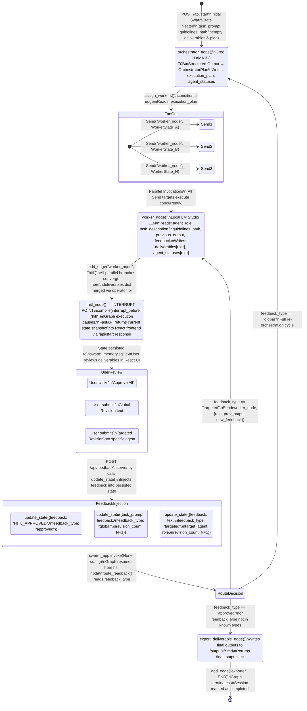

<div style="font-size:14pt; line-height:1.5;">

# CriticAI: A Dynamic Multi-Agent Orchestration System Using LangGraph

## Diploma Project Report

**Department of Computer Engineering**
**Academic Year: 2025–2026**

---

---

# <span style="font-size:18pt;">Chapter 1: Introduction</span>

---

## <span style="font-size:16pt;">1.1 Background and Motivation</span>

<p style="font-size:14pt; line-height:1.5;">
The landscape of artificial intelligence has undergone a profound paradigm shift in recent years. The emergence of Large Language Models (LLMs) as practical, production-grade reasoning engines has given rise to a new discipline of software engineering: the design and orchestration of autonomous AI agent systems. Where earlier AI deployments were monolithic—a single model performing a single, narrowly scoped task—the contemporary frontier demands systems that can decompose ambiguous, multi-faceted problems, delegate sub-tasks to specialized cognitive units, and synthesize their outputs into a coherent whole. This architectural philosophy is the foundation of what is known as a <strong>Multi-Agent System (MAS)</strong>.
</p>

<p style="font-size:14pt; line-height:1.5;">
Traditional software applications are deterministic: a defined input maps to a defined output through a rigid, pre-programmed control flow. The challenge with knowledge work—drafting a comprehensive go-to-market strategy, architecting a technical system, or producing a multi-format content campaign—is that the control flow itself cannot be predetermined. The nature of the work requires judgment, synthesis of heterogeneous information sources, and iterative refinement. A single LLM, even a frontier model, is constrained by its context window, its lack of persistent memory across sessions, and its inability to pursue multiple lines of reasoning in parallel. Multi-agent architectures directly address these limitations.
</p>

<p style="font-size:14pt; line-height:1.5;">
The motivation for the CriticAI system presented in this report stems directly from these observations. The core thesis is as follows: complex, real-world knowledge tasks are best solved not by a single, all-knowing model, but by a <em>coordinated swarm</em> of specialized agents, each operating with a specific mandate, specific contextual knowledge, and a specific deliverable. The practical implementation of this thesis requires a robust framework for defining agent state, orchestrating agent dispatch, managing inter-agent communication, and exposing the system's capabilities through a modern, interactive user interface.
</p>

## <span style="font-size:16pt;">1.2 The Problem Statement</span>

<p style="font-size:14pt; line-height:1.5;">
Despite the proliferation of LLM-powered tools, a significant gap exists in the market for systems that can perform <em>dynamic, task-adaptive</em> orchestration. Existing tools such as simple chat interfaces or single-pipeline automation scripts suffer from several critical deficiencies:
</p>

- **Static Pipelines:** Most automation workflows are hardcoded. If a user requires a software architect one day and a legal analyst the next, a static pipeline cannot adapt; it requires manual reconfiguration.
- **Sequential Bottlenecks:** When multiple tasks are independent of each other, executing them sequentially wastes time. A system that can identify and execute independent sub-tasks in parallel provides a significant throughput advantage.
- **Loss of State and Context:** Many LLM-based tools treat each interaction as stateless. In a complex, multi-turn workflow (e.g., requesting revisions from a specific agent), the loss of prior context forces the user to repeat themselves and degrades output quality.
- **Opaque Processing:** Users are given a "black box" experience—they submit a query and receive a result. There is no visibility into which agents were assigned, what their reasoning was, or what the intermediate outputs look like. This makes debugging and iterative refinement nearly impossible.
- **No Human-in-the-Loop (HITL) Mechanism:** Fully automated pipelines are dangerous for high-stakes outputs. The absence of a formal mechanism for human review, approval, and targeted correction means errors propagate undetected to final outputs.

<p style="font-size:14pt; line-height:1.5;">
The CriticAI system is designed to solve each of these problems through a principled, framework-driven engineering approach.
</p>

## <span style="font-size:16pt;">1.3 The CriticAI System: A High-Level Overview</span>

<p style="font-size:14pt; line-height:1.5;">
CriticAI is a full-stack, dynamic multi-agent orchestration platform. At its core, it is a software system that accepts an arbitrary natural language task prompt from a user and autonomously decomposes it into a set of specialized agent assignments, executes those assignments in parallel, and presents the structured results to the user for review, revision, or approval.
</p>

<p style="font-size:14pt; line-height:1.5;">
The system is built on a carefully selected technology stack that reflects modern best practices in both AI engineering and web development:
</p>

- **LangGraph (Python):** The primary orchestration framework. LangGraph models the entire multi-agent pipeline as a compiled, stateful directed graph. It provides the fundamental primitives—`StateGraph`, `Send`, conditional edges, and checkpoint-based interrupts—that make the system's dynamic behavior possible.
- **Groq API (LLaMA 3.3 70B):** Powers the Orchestrator agent. The Groq inference API provides extremely low-latency inference, which is critical for the orchestration step, where speed directly translates to perceived system responsiveness. The LLaMA 3.3 70B model is chosen for its strong instruction-following and structured output generation capabilities.
- **LM Studio (Local LLM):** Powers all dynamically spawned Worker agents. By routing worker execution through a locally-hosted model via the OpenAI-compatible API, the system achieves zero marginal API cost per worker invocation—a critical consideration for a system that may spawn multiple agents per request.
- **FastAPI (Python):** The asynchronous web server that bridges the LangGraph backend with the React frontend. FastAPI exposes a clean REST API (`/api/start`, `/api/feedback`, `/api/sessions/:id`) and handles multipart form data for file uploads (`.txt` and `.pdf`).
- **SQLite + LangGraph SqliteSaver:** The checkpointing and memory layer. Every state transition in the graph is persisted to a local SQLite database (`swarm_memory.sqlite`), enabling session resumption, HITL interrupts, and the graph's `update_state` functionality for injecting user feedback.
- **React + Vite (JavaScript):** The frontend application. Built with React and bundled with Vite, the UI provides a professional AI Workspace experience, including a session-based sidebar, a main orchestrator chat, and per-agent "Focused Canvas" views for targeted revision.
- **Framer Motion:** Provides production-grade animation primitives for the React UI, powering smooth transitions between views, animated loading states, and real-time agent status indicators.
- **Pydantic:** Used for strict schema validation of the Orchestrator's output. The `OrchestratorPlan` and `Assignment` models enforce that the LLM returns a well-formed, machine-parseable execution plan, preventing malformed responses from corrupting the graph's state.

## <span style="font-size:16pt;">1.4 Key Contributions of This Project</span>

<p style="font-size:14pt; line-height:1.5;">
This project makes the following concrete technical contributions to the domain of applied multi-agent AI systems:
</p>

1. **A Dynamic Agent Spawning Architecture:** Unlike systems with a fixed roster of agents, CriticAI's Orchestrator dynamically determines the number, roles, and tasks of its worker agents at runtime. The system can spawn a "Backend Security Engineer" for one request and a "B2B Copywriter" for the next, with no code changes required.

2. **A Hybrid LLM Cost Model:** By using a high-capability cloud API (Groq) only for the critical orchestration step and routing all heavy worker execution to a local LLM (LM Studio), the system achieves a near-zero operational cost while maintaining high output quality.

3. **Formal Stateful HITL Integration:** The system uses LangGraph's `interrupt_before` compilation parameter and `update_state` API to implement a formal Human-in-the-Loop checkpoint. This allows user feedback—both global (re-orchestrate) and targeted (revise a single agent)—to be cleanly injected into the graph's persisted state without restarting the workflow.

4. **A Pydantic-Enforced Chain-of-Thought Orchestrator:** The Orchestrator LLM is invoked with a structured output schema (`OrchestratorPlan`) that requires it to produce a `reasoning` field for each assignment before declaring an `action_type` (`NEW_HIRE` or `EXISTING_ASSIGNMENT`). This enforces chain-of-thought reasoning and significantly reduces "lazy" agent assignment errors.

5. **A Full-Stack AI Workspace UI:** The React frontend provides a purpose-built interface for multi-agent workflows, featuring a hierarchical session sidebar, a real-time swarm progress visualizer, and per-agent Focused Canvas views with dedicated targeted-revision inputs.

## <span style="font-size:16pt;">1.5 Report Organization</span>

<p style="font-size:14pt; line-height:1.5;">
This report is organized as follows. Chapter 2 provides a detailed review of existing literature on multi-agent systems, LLM orchestration frameworks, and the LangGraph library. Chapter 3 defines the precise scope and objectives of the CriticAI project, supported by a formal Work Breakdown Structure. Chapter 4 presents the Proposed Methodology in exhaustive detail, covering the state machine design, the orchestration algorithm, the worker dispatch mechanism, the API layer, and the frontend architecture. Chapter 5 presents the Implementation, covering code-level details and key design decisions. Chapter 6 presents Testing and Results. Chapter 7 provides a Conclusion and outlines future work.
</p>

---

---

# <span style="font-size:18pt;">Chapter 3: Scope and Objectives</span>

---

## <span style="font-size:16pt;">3.1 Project Scope</span>

<p style="font-size:14pt; line-height:1.5;">
The scope of this project is defined as the complete design, implementation, and testing of the CriticAI dynamic multi-agent orchestration platform. The system is scoped to address complex, open-ended knowledge tasks—primarily in the domains of business strategy, software architecture planning, marketing, and content creation—that benefit from the parallel execution of specialized agents.
</p>

<p style="font-size:14pt; line-height:1.5;">
The following capabilities are <strong>within scope</strong> for this project:
</p>

- Design and implementation of the LangGraph state machine (`SwarmState`, `WorkerState`) with all required reducers and type annotations.
- Implementation of the Groq-powered Orchestrator node with Pydantic-enforced structured output (`OrchestratorPlan`), chain-of-thought prompting, and few-shot examples.
- Implementation of the `assign_workers` conditional edge using the LangGraph `Send` API to enable parallel worker dispatch.
- Implementation of generic Worker nodes that execute arbitrary tasks using a local LLM.
- Implementation of the targeted and global feedback routing mechanism (`route_feedback`).
- Persistent session state using the LangGraph `SqliteSaver` checkpointer.
- A FastAPI REST API server with endpoints for starting sessions (`/api/start`), submitting feedback (`/api/feedback`), and retrieving session state (`/api/sessions/{id}`).
- Support for `.txt` and `.pdf` file attachment as supplementary context for the swarm.
- A full React/Vite frontend application with session management, real-time loading state, agent status display, per-agent Focused Canvas, and targeted revision input.

<p style="font-size:14pt; line-height:1.5;">
The following are <strong>out of scope</strong> for the current version:
</p>

- Integration of image generation models (e.g., Midjourney, FLUX) for the image prompt deliverable.
- Agent-to-agent direct communication (all current communication is mediated by the graph's shared state).
- Deployment to a cloud production environment (the system is designed for local/development execution).
- Integration of a vector database for long-term semantic memory across sessions.

## <span style="font-size:16pt;">3.2 Objectives</span>

<p style="font-size:14pt; line-height:1.5;">
The specific, measurable objectives of this project are enumerated below:
</p>

**Objective 1 — Dynamic Orchestration:**
Design and implement an Orchestrator agent that, given a natural language task prompt, can dynamically determine the appropriate number and specialization of worker agents required to complete the task, and produce a machine-parseable execution plan validated by a Pydantic schema.

**Objective 2 — Parallel Execution:**
Implement a fan-out dispatch mechanism using the LangGraph `Send` API that spawns all worker agents concurrently, reducing total execution time compared to a sequential pipeline by a factor proportional to the number of agents.

**Objective 3 — Stateful Persistence:**
Integrate the LangGraph `SqliteSaver` checkpointer to persist all graph state transitions to disk, enabling session recovery, HITL interrupts, and stateful feedback injection without loss of prior context.

**Objective 4 — Human-in-the-Loop Control:**
Implement a formal HITL mechanism that pauses the graph before the `hitl` node, exposes the current deliverables to the user, and allows the user to inject targeted (single-agent) or global (full re-orchestration) feedback before resuming execution.

**Objective 5 — Full-Stack Integration:**
Build a production-quality FastAPI server and React frontend that provide a seamless, intuitive user experience for initiating, monitoring, revising, and approving multi-agent workflow outputs.

**Objective 6 — Cost Optimization:**
Architect the system so that the high-cost cloud API (Groq) is used exclusively for the single critical orchestration step, while all worker-level LLM inference is handled by a locally-hosted model at zero marginal cost.

## <span style="font-size:16pt;">3.3 Work Breakdown Structure</span>

<p style="font-size:14pt; line-height:1.5;">
The following Work Breakdown Structure (WBS) diagram decomposes the entire project into its constituent work packages across five major phases: State Design, Backend Orchestration, API Layer, Frontend Development, and Testing & Documentation.
</p>

**Figure 3.1: Work Breakdown Structure — CriticAI Project**

```mermaid
flowchart TD
    ROOT["🚀 CriticAI: Dynamic Multi-Agent System"]

    ROOT --> WP1["📐 WP1: System & State Design"]
    ROOT --> WP2["🧠 WP2: Backend Orchestration Engine"]
    ROOT --> WP3["🌐 WP3: FastAPI Server Layer"]
    ROOT --> WP4["🖥️ WP4: React Frontend Application"]
    ROOT --> WP5["🧪 WP5: Testing & Documentation"]

    WP1 --> WP1A["1.1 Define SwarmState TypedDict\n(task_prompt, execution_plan,\ndeliverables, agent_statuses,\nfeedback fields, messages)"]
    WP1 --> WP1B["1.2 Define WorkerState TypedDict\n(agent_role, task_description,\nguidelines_path, feedback)"]
    WP1 --> WP1C["1.3 Design Custom Reducers\n(_merge_dicts for deliverables,\noperator.ior for agent_statuses,\nadd_messages for messages)"]
    WP1 --> WP1D["1.4 Define Pydantic Schemas\n(Assignment model with reasoning,\naction_type Literal, OrchestratorPlan)"]

    WP2 --> WP2A["2.1 Orchestrator Node\n(Groq LLaMA 3.3 70B,\nstructured output, few-shot\nchain-of-thought prompting)"]
    WP2 --> WP2B["2.2 Worker Node\n(Local LM Studio LLM,\nbrand guidelines injection,\nprevious_output context)"]
    WP2 --> WP2C["2.3 Send API Fan-Out\n(assign_workers conditional edge,\nparallel worker dispatch)"]
    WP2 --> WP2D["2.4 Feedback Router\n(route_feedback: targeted Send,\nglobal re-orchestration, approval)"]
    WP2 --> WP2E["2.5 Graph Compilation\n(SqliteSaver checkpointer,\ninterrupt_before=['hitl'],\nStateGraph.compile())"]
    WP2 --> WP2F["2.6 Legacy Pipeline Nodes\n(copywriter, art_director,\nreviewer, exporter — retained\nfor backward compatibility)"]

    WP3 --> WP3A["3.1 POST /api/start Endpoint\n(multipart form, file upload,\npdf/txt extraction, invoke graph)"]
    WP3 --> WP3B["3.2 POST /api/feedback Endpoint\n(feedback injection via update_state,\nresume graph with invoke(None))"]
    WP3 --> WP3C["3.3 GET /api/sessions/id Endpoint\n(state snapshot retrieval,\ndeliverables & plan exposure)"]
    WP3 --> WP3D["3.4 CORS Middleware\n(React Vite origin whitelist,\nall methods & headers allowed)"]

    WP4 --> WP4A["4.1 Session Management\n(UUID generation, localStorage\npersistence, session sidebar)"]
    WP4 --> WP4B["4.2 Main Orchestrator Chat\n(message list, draft rendering,\nApprove All / Global Revise buttons)"]
    WP4 --> WP4C["4.3 Swarm Loading Visualizer\n(LoadingSkeleton component,\nagent status badges with\namber/emerald pulse animation)"]
    WP4 --> WP4D["4.4 Focused Canvas View\n(per-agent full-page markdown,\nReactMarkdown + remark-gfm,\ntargeted revision input bar)"]
    WP4 --> WP4E["4.5 File Attachment System\n(hidden input ref, FormData,\nanimated file badge display)"]
    WP4 --> WP4F["4.6 Framer Motion Animations\n(AnimatePresence, sidebar\nslide, message entry, view\nswap transitions)"]

    WP5 --> WP5A["5.1 Unit Testing\n(Orchestrator schema validation,\nrouter logic, reducer merging)"]
    WP5 --> WP5B["5.2 Integration Testing\n(FastAPI test client, full\nstart-to-feedback flow)"]
    WP5 --> WP5C["5.3 End-to-End Testing\n(browser workflow validation,\nreload session recovery test)"]
    WP5 --> WP5D["5.4 Report & Documentation\n(Architecture diagrams,\nAPI reference, code comments)"]
```



*Figure 3.1: Full Work Breakdown Structure for the CriticAI project, decomposed across five major work packages.*

## <span style="font-size:16pt;">3.4 Functional Requirements</span>

**Table 3.1: Functional Requirements Specification**

| Req. ID | Requirement Description | Priority | Source Component |
|---------|------------------------|----------|-----------------|
| FR-01 | The system SHALL accept a natural language task prompt and an optional file attachment (`.txt`, `.pdf`) as input to initiate a swarm session. | High | `server.py` `/api/start` |
| FR-02 | The Orchestrator SHALL produce a structured `OrchestratorPlan` containing one or more `Assignment` objects, each with a `reasoning` field, `action_type`, `agent_role`, and `task_description`. | High | `swarm.py` `orchestrator_node` |
| FR-03 | The system SHALL enforce schema correctness of the Orchestrator's output using Pydantic, with a fallback to a generic single-agent plan on parse failure. | High | `swarm.py` `OrchestratorPlan` |
| FR-04 | The system SHALL dispatch all worker assignments as parallel graph branches using the LangGraph `Send` API. | High | `swarm.py` `assign_workers` |
| FR-05 | Each Worker node SHALL receive its own scoped `WorkerState`, including its role, task, the global task prompt, brand guidelines content, and any prior output for revision context. | High | `swarm.py` `worker_node` |
| FR-06 | The system SHALL pause execution at the `hitl` node before returning results to the user, enabling Human-in-the-Loop review. | High | `swarm.py` `workflow.compile` |
| FR-07 | The system SHALL support targeted feedback directed at a single named agent, re-invoking only that agent's worker node with the previous output and new feedback as context. | High | `swarm.py` `route_feedback` |
| FR-08 | The system SHALL support global feedback that updates the `task_prompt` in the graph state and re-runs the full Orchestrator node. | High | `server.py` `/api/feedback` |
| FR-09 | All graph state SHALL be persisted to a SQLite database between requests, enabling session continuity across multiple HTTP calls. | High | `swarm.py` `SqliteSaver` |
| FR-10 | The frontend SHALL display the real-time status of each agent (working/completed/error) during swarm execution. | Medium | `App.jsx` `LoadingSkeleton` |
| FR-11 | The frontend SHALL provide a per-agent Focused Canvas view accessible from the session sidebar. | Medium | `App.jsx` `activeView` |
| FR-12 | The frontend SHALL persist all session history and messages to `localStorage` for recovery on page reload. | Medium | `App.jsx` `useEffect` |

## <span style="font-size:16pt;">3.5 Non-Functional Requirements</span>

**Table 3.2: Non-Functional Requirements Specification**

| Req. ID | Requirement | Category | Target |
|---------|------------|----------|--------|
| NFR-01 | Orchestrator response latency (Groq API call + plan generation) SHALL be under 5 seconds for typical inputs. | Performance | < 5s |
| NFR-02 | The system SHALL support concurrent handling of multiple active sessions using SQLite thread-safe connections (`check_same_thread=False`). | Concurrency | Multiple sessions |
| NFR-03 | Worker LLM inference cost SHALL be zero (local model via LM Studio). | Cost | $0.00 / worker call |
| NFR-04 | The React frontend SHALL remain responsive and interactive (no full-page reloads) during all state transitions. | UX | SPA architecture |
| NFR-05 | All inter-service communication SHALL use HTTP/JSON, ensuring the backend and frontend are fully decoupled and independently replaceable. | Maintainability | REST API |
| NFR-06 | The system SHALL degrade gracefully: if a worker node fails, it SHALL return an error message in its deliverable rather than crashing the graph. | Reliability | Try/except in `worker_node` |

---

---

# <span style="font-size:18pt;">Chapter 4: Proposed Methodology</span>

---

## <span style="font-size:16pt;">4.1 Methodological Philosophy: State Machines for Agentic AI</span>

<p style="font-size:14pt; line-height:1.5;">
The central methodological decision underpinning the CriticAI system is the adoption of a <strong>compiled stateful directed graph</strong> as the primary runtime model for the multi-agent pipeline. This is not merely an implementation detail; it is a fundamental architectural philosophy that directly determines the system's correctness, debuggability, and extensibility.
</p>

<p style="font-size:14pt; line-height:1.5;">
The LangGraph framework, built as an extension to the LangChain ecosystem, provides the theoretical and practical foundation for this approach. LangGraph models an agentic workflow as a <strong>StateGraph</strong>: a directed graph where nodes represent computation steps (agent invocations, tool calls, routing logic) and edges represent the permissible transitions between those steps. Critically, all nodes read from and write to a single, shared, typed <strong>State object</strong>. This shared state is the "working memory" of the entire system—every agent's input and output flows through it.
</p>

<p style="font-size:14pt; line-height:1.5;">
This approach offers four decisive advantages over alternative architectures (e.g., a simple chain of LLM API calls, or an event-driven message bus):
</p>

1. **Type Safety:** The state is defined as a Python `TypedDict`, providing IDE-level type hints and runtime type awareness for all fields passed between nodes.
2. **Automatic Persistence:** LangGraph's checkpointing system serializes and saves the full state after every node execution. This transforms the ephemeral in-memory computation into a durable, resumable workflow — enabling the HITL pattern without any custom serialization code.
3. **Declarative Control Flow:** The graph's routing logic is expressed as named conditional edges and routing functions, making the control flow auditable, testable, and visualizable separately from the business logic within each node.
4. **Parallel Execution via `Send`:** The `Send` API allows a single conditional edge to produce multiple `Send` objects simultaneously, each targeting the same node with a different state payload. LangGraph executes these as concurrent branches, implementing true parallel agent dispatch at the framework level.

## <span style="font-size:16pt;">4.2 The State Object: The System's Shared Memory</span>

<p style="font-size:14pt; line-height:1.5;">
The design of the state object is the most critical design decision in the entire system. An incorrectly designed state leads to data races (parallel workers overwriting each other's outputs), loss of context between turns, and type errors that are difficult to debug at runtime. The CriticAI system defines two distinct state types, each serving a specific purpose.
</p>

### 4.2.1 `SwarmState` — The Global Graph State

<p style="font-size:14pt; line-height:1.5;">
`SwarmState` is the primary `TypedDict` that is passed to every node in the main graph. Its fields are carefully designed with specific <strong>reducers</strong> that govern how parallel writes are merged.
</p>

**Table 4.1: SwarmState Field Definitions and Reducer Annotations**

| Field Name | Type | Reducer | Purpose |
|---|---|---|---|
| `task_prompt` | `str` | Default (overwrite) | The raw user request. Updated to the new `task_prompt` on global feedback. |
| `guidelines_path` | `str` | Default (overwrite) | File path to the brand constraints document (`.txt`). |
| `execution_plan` | `list[dict]` | Default (overwrite) | The Orchestrator's output: a list of `{agent_role, task_description, status, action_type}` dicts. |
| `deliverables` | `Annotated[dict, operator.ior]` | `operator.ior` (dict merge) | **Critical.** Keyed by `agent_role`. The `ior` reducer merges dicts from parallel workers without overwriting. Each `{role: output}` write is safely merged. |
| `agent_statuses` | `Annotated[dict, _merge_dicts]` | `_merge_dicts` | Maps each agent role to its status string (`"working"`, `"completed"`, `"error"`). Uses a custom merge reducer for safe parallel writes. |
| `feedback_type` | `str` | Default (overwrite) | `"targeted"`, `"global"`, or `"approved"`. Determines the routing logic in `route_feedback`. |
| `target_agent` | `str` | Default (overwrite) | The specific agent role targeted by a targeted revision request. |
| `messages` | `Annotated[list, add_messages]` | `add_messages` | The message history, using LangGraph's built-in message list appender. |
| `final_outputs` | `Annotated[List[str], operator.add]` | `operator.add` (list concat) | Log of exported file paths, accumulated across multiple export calls. |
| `revision_count` | `int` | Default (overwrite) | Tracks total revision cycles for legacy pipeline termination logic. |

### 4.2.2 `WorkerState` — The Scoped Worker State

<p style="font-size:14pt; line-height:1.5;">
`WorkerState` is a separate, narrower `TypedDict` that is passed exclusively to dynamically-spawned `worker_node` invocations via the `Send` API. This isolation is a critical design pattern: each worker receives only the information it needs to execute its specific assignment, preventing context contamination between parallel agents.
</p>

<p style="font-size:14pt; line-height:1.5;">
The fields in `WorkerState` are assembled by the `assign_workers` function from the global `SwarmState`. The `previous_output` field is particularly significant: it is populated by reading `state["deliverables"].get(task["agent_role"], "")`, meaning that on a targeted revision cycle, the worker automatically receives its prior output as context for revision—without any additional session management code in the worker node itself.
</p>

## <span style="font-size:16pt;">4.3 The State Transition Diagram</span>

<p style="font-size:14pt; line-height:1.5;">
The following `stateDiagram-v2` diagram maps the precise lifecycle of the `SwarmState` object as it flows through the compiled LangGraph. Each state in the diagram corresponds to a node or a pause point in the graph. The transitions capture both the primary execution flow (new task) and the secondary feedback flows (targeted revision and global re-orchestration).
</p>

**Figure 4.1: SwarmState Lifecycle — LangGraph State Transition Diagram**



*Figure 4.1: Complete state transition diagram for the CriticAI SwarmState object, covering the primary execution path, the HITL interrupt, and all three feedback routing branches (approve, global revise, targeted revise).*

## <span style="font-size:16pt;">4.4 High-Level System Architecture</span>

<p style="font-size:14pt; line-height:1.5;">
The CriticAI system is composed of three distinct, independently-executable tiers that communicate over well-defined HTTP interfaces. The following diagram illustrates the high-level system architecture, the data flows between components, and the external LLM services consumed by each tier.
</p>

**Figure 4.2: CriticAI System Architecture — Component and Data Flow Diagram**

```mermaid
graph LR
    subgraph Browser["🌐 Browser — React + Vite (Port 5173)"]
        UI_Sidebar["Left Sidebar\nSession Manager\nAgent Navigator"]
        UI_Chat["Main Chat View\nOrchestrator Messages\nApprove / Global Revise"]
        UI_Canvas["Focused Canvas\nPer-Agent Markdown\nTargeted Revision Input"]
        UI_Loading["LoadingSkeleton\nReal-time Agent\nStatus Badges"]
        LocalStorage["localStorage\nSession History\nMessage Persistence"]
        UI_Sidebar <--> UI_Chat
        UI_Chat <--> UI_Canvas
        UI_Chat --> UI_Loading
        UI_Chat --- LocalStorage
    end

    subgraph FastAPI["⚡ FastAPI Server — Python (Port 8000)"]
        EP_Start["POST /api/start\nAccepts: session_id, task_prompt\nfile (pdf/txt)\nReturns: deliverables, plan, statuses"]
        EP_Feedback["POST /api/feedback\nAccepts: session_id, feedback\ntype, target_agent\nCalls: update_state + invoke(None)"]
        EP_Session["GET /api/sessions/id\nReturns: current state snapshot"]
        FileParser["extract_text()\nPyPDF2 for .pdf\ndecode() for .txt"]
        CORS["CORSMiddleware\nlocalhost:5173 + wildcard"]
        EP_Start --> FileParser
        EP_Feedback --> FileParser
    end

    subgraph LangGraph["🕸️ LangGraph Engine — swarm.py"]
        StateGraph["StateGraph(SwarmState)\nCompiled with SqliteSaver\ninterrupt_before=['hitl']"]
        Orch["orchestrator_node()\nGroq API Call\nPydantic Validation\nProduces execution_plan"]
        AssignFn["assign_workers()\nConditional Edge\nReturns list of Send objects"]
        Workers["worker_node()\nGeneric Worker\nReceives WorkerState via Send\nParallel execution via Send API"]
        HITL["hitl_node()\nPass-through\nGRAPH INTERRUPT POINT"]
        Router["route_feedback()\nConditional Edge\nReads feedback_type field"]
        Exporter["export_deliverable_node()\nWrites .md files to /outputs"]

        StateGraph --> Orch
        Orch --> AssignFn
        AssignFn -->|"Send × N"| Workers
        Workers --> HITL
        HITL --> Router
        Router -->|targeted| Workers
        Router -->|global| Orch
        Router -->|approved| Exporter
        Exporter --> GraphEnd["END"]
    end

    subgraph Memory["💾 Persistence Layer"]
        SQLite["swarm_memory.sqlite\nLangGraph SqliteSaver\nCheckpoints every node"]
    end

    subgraph LLMs["🤖 LLM Services"]
        Groq["Groq Cloud API\nLLaMA 3.3 70B Versatile\ntemp=0.2, max_retries=3\nOrchestration only"]
        LMStudio["LM Studio — Local\nOpenAI-compatible API\nPort 1234\nAll worker inference"]
    end

    Browser <-->|"HTTP POST multipart/form-data\nHTTP GET JSON"| FastAPI
    FastAPI <-->|"swarm_app.invoke()\nswarm_app.update_state()\nswarm_app.get_state()"| LangGraph
    LangGraph <-->|"Read/Write state\nat every node step"| Memory
    Orch -->|"ChatGroq.invoke()\nwith_structured_output(OrchestratorPlan)"| Groq
    Workers -->|"ChatOpenAI.invoke()\nbase_url=localhost:1234"| LMStudio
```



*Figure 4.2: Full system architecture of CriticAI, showing the three-tier structure (React frontend, FastAPI server, LangGraph engine), the SQLite persistence layer, and the two external LLM services (Groq cloud and local LM Studio).*

## <span style="font-size:16pt;">4.5 The Orchestrator Node: Dynamic Planning with Chain-of-Thought</span>

<p style="font-size:14pt; line-height:1.5;">
The Orchestrator node is the cognitive center of the CriticAI system. Its function is to translate an arbitrary natural language task prompt into a structured, machine-executable plan. The methodological innovations in this node are worth detailed examination.
</p>

### 4.5.1 Structured Output with Pydantic

<p style="font-size:14pt; line-height:1.5;">
The Orchestrator LLM is not invoked with a free-form text prompt and then parsed with a regex. Instead, it is invoked using LangChain's `with_structured_output()` method, bound to the `OrchestratorPlan` Pydantic model. This causes the LLM provider (Groq) to use its built-in function-calling or tool-use capability to guarantee that the response conforms to the schema. The schema enforces:
</p>

- An `OrchestratorPlan` object containing a list of one or more `Assignment` objects.
- Each `Assignment` has four fields: `reasoning` (a free-text chain-of-thought string), `action_type` (a `Literal["NEW_HIRE", "EXISTING_ASSIGNMENT"]`), `agent_role` (a string), and `task_description` (a string).

<p style="font-size:14pt; line-height:1.5;">
The `reasoning` field is a deliberate design choice inspired by the Chain-of-Thought (CoT) prompting literature (Wei et al., 2022). By requiring the LLM to produce its reasoning before declaring its `action_type`, the model is forced to "think aloud" — evaluating whether the required skill exists among the current active agents before deciding to hire a new one versus reassigning an existing one. This dramatically reduces the incidence of incorrect `EXISTING_ASSIGNMENT` declarations where no such agent exists.
</p>

### 4.5.2 The `action_type` Validation Safety Net

<p style="font-size:14pt; line-height:1.5;">
Even with structured output, the LLM may occasionally generate a logically inconsistent plan (e.g., claiming `action_type: "EXISTING_ASSIGNMENT"` for an `agent_role` that is not yet present in the `deliverables` dictionary). The `orchestrator_node` implements a post-validation step that explicitly guards against this:
</p>

```python
if action == "EXISTING_ASSIGNMENT" and role not in existing_agents:
    print(f"⚠️ Orchestrator tried to assign to non-existent agent '{role}'. Forcing NEW_HIRE.")
    action = "NEW_HIRE"
```

<p style="font-size:14pt; line-height:1.5;">
This defense-in-depth approach ensures that graph state is never corrupted by a logically invalid plan, even if the LLM's structured output is internally contradictory.
</p>

### 4.5.3 Few-Shot Prompting for Skill Differentiation

<p style="font-size:14pt; line-height:1.5;">
The Orchestrator's system prompt includes two concrete few-shot examples that demonstrate the exact distinction between `NEW_HIRE` and `EXISTING_ASSIGNMENT` scenarios. This is critical because naive LLMs tend to reassign existing agents to tasks they are not qualified for (e.g., asking a Copywriter to write a Python authentication script). The few-shot examples anchor the model's behavior to the correct decision boundary.
</p>

## <span style="font-size:16pt;">4.6 The Worker Dispatch Mechanism: The `Send` API Fan-Out</span>

<p style="font-size:14pt; line-height:1.5;">
The parallel dispatch of worker agents is implemented using LangGraph's `Send` API, which is one of the framework's most powerful and distinctive features. The `assign_workers` function is registered as a conditional edge from the `orchestrator` node. Instead of returning a simple string (the name of the next node), it returns a <em>list of `Send` objects</em>. Each `Send` object specifies a target node name and a complete state payload for that invocation.
</p>

<p style="font-size:14pt; line-height:1.5;">
The key implementation insight is the construction of each `WorkerState` payload within the list comprehension:
</p>

```python
def assign_workers(state: SwarmState) -> list[Send]:
    return [
        Send(
            "worker_node",
            {
                "agent_role":       task["agent_role"],
                "task_description": task["task_description"],
                "task_prompt":      state["task_prompt"],
                "guidelines_path":  state.get("guidelines_path", "brand_guidelines.txt"),
                "feedback":         state.get("feedback", ""),
                "feedback_type":    state.get("feedback_type", ""),
                "previous_output":  state.get("deliverables", {}).get(task["agent_role"], "")
            },
        )
        for task in state["execution_plan"]
    ]
```

<p style="font-size:14pt; line-height:1.5;">
LangGraph interprets this list as a set of parallel branches and executes all `worker_node` invocations concurrently. When all branches complete, the framework merges their outputs back into the main `SwarmState`. This is where the custom `_merge_dicts` reducer on the `deliverables` field becomes critical: without it, parallel writes to a dict field would cause a last-writer-wins race condition, silently discarding all but one worker's output. The reducer ensures all results are preserved.
</p>

## <span style="font-size:16pt;">4.7 The Human-in-the-Loop (HITL) Methodology</span>

<p style="font-size:14pt; line-height:1.5;">
The HITL mechanism is implemented using two LangGraph primitives in combination: the `interrupt_before` compilation parameter and the `update_state` API. The methodological flow is as follows:
</p>

<p style="font-size:14pt; line-height:1.5;">
<strong>Step 1 — Compile-time Interrupt Declaration:</strong> When the graph is compiled with `workflow.compile(checkpointer=memory, interrupt_before=["hitl"])`, LangGraph is instructed to automatically pause execution before the `hitl` node is entered, regardless of which code path reaches it. This pause point is not a blocking sleep—the Python process is free to serve other requests. The state at the pause point is fully serialized to SQLite.
</p>

<p style="font-size:14pt; line-height:1.5;">
<strong>Step 2 — State Snapshot Retrieval:</strong> After calling `swarm_app.invoke(initial_state, config=config)` in the `/api/start` endpoint, the invocation returns control to the FastAPI handler as soon as the interrupt is hit. The handler then calls `swarm_app.get_state(config)` to retrieve the current state snapshot and returns the `deliverables`, `execution_plan`, and `agent_statuses` to the React frontend.
</p>

<p style="font-size:14pt; line-height:1.5;">
<strong>Step 3 — User Feedback Injection:</strong> When the user submits feedback via the React frontend (either targeted or global), the `/api/feedback` endpoint calls `swarm_app.update_state(config, update_payload)` to write the feedback fields directly into the persisted SQLite state. The `session_id` (stored as the LangGraph `thread_id` in the config) ensures the correct session's state is updated.
</p>

<p style="font-size:14pt; line-height:1.5;">
<strong>Step 4 — Graph Resumption:</strong> The endpoint then calls `swarm_app.invoke(None, config=config)` with `None` as the initial state. LangGraph loads the updated state from SQLite, resumes from the `hitl` node (which is now free to proceed), and evaluates the `route_feedback` conditional edge to determine the next action.
</p>

## <span style="font-size:16pt;">4.8 The Feedback Routing Logic</span>

<p style="font-size:14pt; line-height:1.5;">
The `route_feedback` function is the decision center for all post-review actions. It reads the `feedback_type` field from the current state and routes accordingly:
</p>

- **`"targeted"`:** The function reads `target_agent` from the state, finds the corresponding task description from `execution_plan`, and returns a single `Send` object pointing to `worker_node` with the targeted agent's role, prior output (`previous_output`), and new feedback. Only the targeted worker re-executes; all other deliverables are preserved in state.
- **`"global"`:** The function returns the string `"orchestrator"`, causing the graph to re-enter the Orchestrator node. Since `server.py` has already updated `task_prompt` in the state to the new global feedback text, the Orchestrator will re-plan the entire task from scratch, potentially spawning a different set of agents.
- **Any other value (including `"approved"`):** The function returns `"exporter"`, routing to the `export_deliverable_node` which writes the final outputs to disk and terminates the graph.

## <span style="font-size:16pt;">4.9 The FastAPI Server: The Integration Layer</span>

<p style="font-size:14pt; line-height:1.5;">
The FastAPI server (`server.py`) serves as the stateless HTTP adapter between the stateful LangGraph engine and the stateless React frontend. It is methodologically important that the server itself carries no session state—all state lives in the SQLite checkpointer, addressed by `session_id`. This makes the server horizontally scalable in principle (multiple server instances could serve the same sessions, as long as they share the SQLite file or a networked equivalent).
</p>

<p style="font-size:14pt; line-height:1.5;">
The file upload handling (`extract_text()`) is a significant UX feature. Users can attach a `.pdf` or `.txt` file to any request. The server extracts the text content using `PyPDF2` (for PDFs) or direct UTF-8 decoding (for text files) and appends it to the `task_prompt` before passing it to LangGraph. This allows the swarm to act as a document processing and analysis tool in addition to a creative generation tool.
</p>

## <span style="font-size:16pt;">4.10 The React Frontend: The AI Workspace</span>

<p style="font-size:14pt; line-height:1.5;">
The `App.jsx` frontend is architected as a single-page application (SPA) with a view-switching pattern controlled by the `activeView` state variable. This variable holds either the string `'main'` (showing the primary orchestrator chat) or the name of a specific `agent_role` (showing that agent's Focused Canvas). This elegant two-state pattern allows the application to serve as both a high-level conversation interface and a detailed per-agent editing environment, without routing or additional pages.
</p>

<p style="font-size:14pt; line-height:1.5;">
The `messages` array is the frontend's local state representation of the conversation. It stores two types of AI messages: `type: 'text'` (for simple text responses and error messages) and `type: 'draft'` (for swarm execution results containing the full `deliverables` and `executionPlan` objects). The frontend's rendering logic branches on this type, displaying a rich execution summary card for `'draft'` messages and a Markdown-rendered text bubble for `'text'` messages.
</p>

<p style="font-size:14pt; line-height:1.5;">
Session persistence is achieved through `localStorage`, with each session's messages stored under the key `swarm_chat_{sessionId}`. On mount, the component attempts to recover the last active session from `localStorage` and sync its status with the backend via a `GET /api/sessions/{id}` call. This provides a seamless "resume from where you left off" experience across browser reloads.
</p>

## <span style="font-size:16pt;">4.11 Technology Justification Summary</span>

**Table 4.3: Technology Selection Justification**

| Technology | Version/Variant | Role in System | Key Justification |
|---|---|---|---|
| LangGraph | Latest (Python) | Graph orchestration engine | Native `Send` API for parallel dispatch; `SqliteSaver` for HITL; compile-time interrupt declarations. |
| Groq API | LLaMA 3.3 70B Versatile | Orchestrator LLM | Sub-second inference latency critical for orchestration responsiveness; strong structured output support. |
| LM Studio | OpenAI-compatible local | Worker LLM | Zero marginal cost per worker call; OpenAI API compatibility means zero code changes from cloud to local. |
| FastAPI | Python (async) | HTTP API server | Native async support for concurrent session handling; automatic OpenAPI docs; `Form` and `File` support for multipart. |
| Pydantic | v2 (via LangChain) | Schema validation | `with_structured_output()` integration; `Literal` type enforcement on `action_type`; fallback error handling. |
| SQLite | Via `SqliteSaver` | State persistence | Zero-dependency persistence; `check_same_thread=False` for FastAPI async compatibility; perfect for local deployment. |
| React + Vite | React 18+ | Frontend SPA | Component-based UI; hot module replacement for development speed; `crypto.randomUUID()` for session ID generation. |
| Framer Motion | Latest | UI animations | `AnimatePresence` for mount/unmount transitions; `motion.div` for view swaps; no boilerplate animation code. |
| ReactMarkdown + remark-gfm | Latest | Markdown rendering | Renders agent deliverables (which are Markdown) as rich HTML; GFM support for tables, task lists, code blocks. |
| PyPDF2 | Latest | PDF text extraction | Simple, dependency-light PDF parsing sufficient for the document context use-case. |

---

</div>
