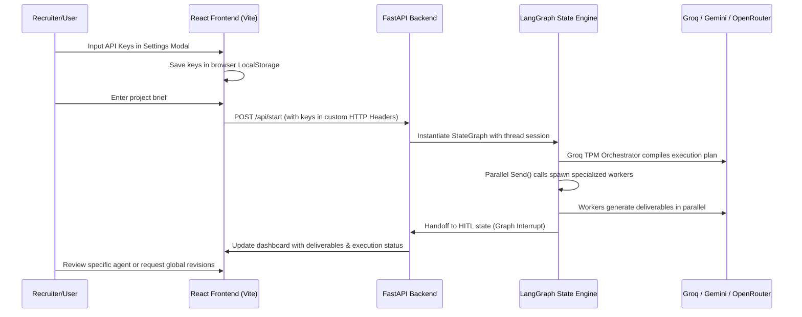

# 🤖 CriticAI: Multi-Agent LLM Orchestration Swarm

**CriticAI** is a premium, state-of-the-art multi-agent workflow system built using **FastAPI**, **LangGraph**, and **React**. It automates complex product launches, campaign setups, and engineering tasks by orchestrating an elite AI "swarm" that collaborates, works in parallel, gathers human feedback, and executes tasks.

Recruiters and developers can select their preferred LLM provider (**Groq**, **Gemini**, or **OpenRouter**) and securely configure keys directly within the premium dashboard.

---

## 🎨 Premium Features

- 🧠 **Dynamic Swarm Orchestrator**: Uses a Llama-3.3-70B model to break down any user brief into a structured multi-agent project plan.
- ⚡ **Parallel Worker Dispatch**: Spawns multiple specialized agents (e.g., Marketing Strategists, Copywriters, AI/ML Architects) to execute tasks in parallel using LangGraph's Send API.
- 💬 **Human-in-the-Loop (HITL) Collaboration**: Automatically halts execution and awaits feedback. Users can request **Global Revisions** (re-triggering the orchestrator) or **Targeted Revisions** (targeting a specific agent's canvas).
- 🔒 **Secure Local Settings**: Stores API keys securely in the browser's `localStorage` (never written to disk or sent to remote databases) and passes them to the local server via custom HTTP headers.
- 📂 **Structured Markdown Exporter**: Compiles and exports all agent outputs into a beautifully formatted, consolidated Markdown project report in the `outputs/` folder.

---

## 🏗️ Architecture & Data Flow



---

## 🚀 Getting Started

### Prerequisites
Make sure you have the following installed on your machine:
- **Python 3.10+** (Python 3.14 recommended)
- **Node.js & NPM**

### Fast Bootstrapping (Windows)
We have provided a unified startup script. Simply double-click **`start.bat`** in the root of the project. The script will:
1. Recreate/repair the Python virtual environment if missing or broken.
2. Install all required backend packages (`fastapi`, `langgraph`, `langchain-groq`, etc.).
3. Check and install frontend packages (`npm install` inside `swarm-ui/`).
4. Concurrently spin up the FastAPI server and the Vite React server.

Once booted, open your browser to **`http://localhost:5173`** to access the dashboard.

---

## 🔑 LLM API Key Configuration
1. Click the **Cog (Settings) Icon** in the sidebar.
2. Choose your default LLM Provider:
   - **Groq**: Uses `llama-3.3-70b-versatile` for orchestrator, `llama-3.1-8b-instant` for workers.
   - **Gemini**: Uses `gemini-1.5-flash` for fast, lightweight performance.
   - **OpenRouter**: Accesses free-tier models such as Llama-3-8b and Gemini-2.0-Flash.
3. Paste your API key, click **Save Settings**, and you're ready to run!

---

## 📂 Project Structure

```
CriticAI/
│
├── server.py              # FastAPI server (API endpoints, header extraction)
├── swarm.py               # LangGraph swarm engine & dynamic LLM factory
├── _test_orchestrator.py  # Local smoke test verification script
├── requirements.txt       # Python backend dependencies
├── start.bat              # Out-of-the-box Windows runner script
│
├── swarm-ui/              # Vite + React Frontend
│   ├── package.json       # React dependencies (framer-motion, lucide-react)
│   ├── tailwind.config.js # Tailwind styling config
│   └── src/
│       ├── App.jsx        # Premium dashboard logic & Settings panel
│       └── App.css        # Custom CSS scrollbar and scroll logic
```

---

## 🛠️ Technology Stack
- **Backend**: FastAPI, Uvicorn, LangGraph, LangChain Core/OpenAI/Groq/Google GenAI, SQLite (checkpoint saver).
- **Frontend**: React 19, Vite, TailwindCSS, Framer Motion (animations), Lucide React (icons).
