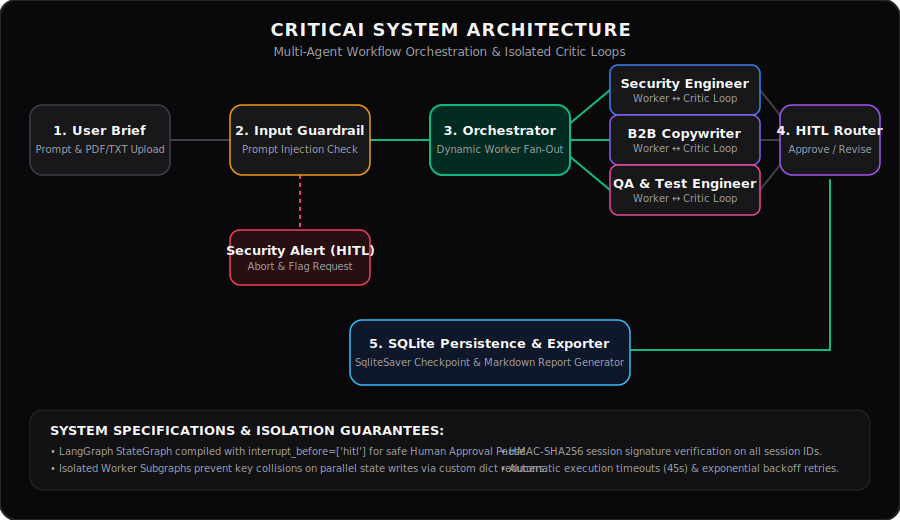
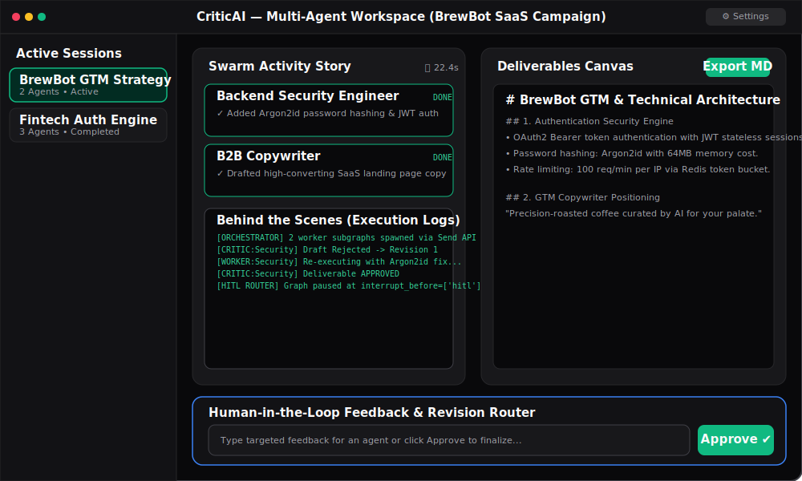

# CriticAI System Engineering Report & System Specification

**CriticAI** is a multi-agent workflow orchestration system designed to process complex tasks through guardrailed input validation, dynamic agent plan decomposition, parallel worker dispatch with isolated critic feedback loops, and persistent state management.

---

## 1. System Architecture & Visual Assets



### UI Dashboard Overview



### Core Engineering Components
- **API Engine**: FastAPI (`server.py`) wrapping a Python-SocketIO server (`socket_server.py`) running on Uvicorn.
- **Orchestration Graph**: LangGraph `StateGraph` state machine (`swarm.py`) utilizing SQLite (`swarm_memory.sqlite`) with `SqliteSaver` for checkpointing state.
- **Worker Subgraphs**: Isolated subgraphs (`_worker_sub`) mapping `WorkerState` to prevent key collisions when parallel worker threads write state updates.
- **Frontend UI**: React 18 SPA built with Vite and TailwindCSS (`swarm-ui/`), communicating via HTTP REST and Socket.IO websockets.

---

## 2. System Demo (60–90 Second Interactive Workflow)

CriticAI includes a self-contained demonstration script (`demo.py`) that showcases the entire multi-agent workflow execution within a 60–90 second window.

### Demo Capabilities Covered:
1. **Input Security Guardrail**: Prompt injection & safety policy classification.
2. **Orchestrator Decomposition**: Dynamic task brief breakdown into specialized agent roles (e.g., *Backend Security Engineer*, *B2B Copywriter*).
3. **Parallel Worker Dispatch & Critic Revision Loop**: Fan-out worker execution, critic evaluation, rejection with constructive feedback, worker revision, and critic approval.
4. **Human-in-the-Loop (HITL) Pause**: Graph execution pause at `interrupt_before=['hitl']` awaiting human review.
5. **State Persistence & Export**: SQLite thread checkpointing (`swarm_memory.sqlite`) and Markdown deliverable output generation (`outputs/project_output_demo.md`).

### Running the Demo:

```bash
# Automated Unattended Demo (Runs in ~75 seconds)
python demo.py --auto --duration 75

# Interactive Demo (Prompts evaluator during HITL pause)
python demo.py
```

---

## 3. Evaluation Suite & Benchmark Metrics

The system includes a quantitative evaluation suite (`evals/eval_suite.py` and `tests/test_evals.py`) to benchmark swarm performance across core criteria.

| Metric | Target / Benchmark | Description & Methodology |
| :--- | :---: | :--- |
| **Plan Completeness** | **≥ 0.85** | Measures whether the orchestrator plan assigns at least 2 distinct roles covering required task capabilities and domain constraints. |
| **Critic Agreement Rate** | **≥ 0.80** | Ratio of agent deliverables approved vs. rejected by the lead critic quality reviewer across execution turns. |
| **Retry Rate** | **≤ 0.35** | Fraction of worker tasks requiring internal critic revisions or LLM API retries before reaching approval. |
| **End-to-End Latency** | **< 30s** | Total end-to-end execution duration including guardrail, orchestrator, parallel workers, and critic loops. |
| **Cost Per Run (USD)** | **<$0.005** | Token usage tracking (prompt & completion tokens per node) mapped to model rate cards ($/1M tokens). |

### Running the Evaluation Suite:

```bash
# Execute PyTest evaluation test cases
.\venv\Scripts\pytest.exe tests/test_evals.py

# Run standalone evaluation benchmark summary
.\venv\Scripts\python.exe evals/eval_suite.py
```

---

## 4. Verification & Test Suite Results

The backend engine includes unit and integration tests executing in an isolated environment where external LLM services are mocked out.

### Test Suite Execution Summary

**Command**: `pytest`
**Result**: 23 Passed | 0 Failed | 0 Errored (Execution Time: 3.53s)

| Test File | Test Case | Target Module | Status | Verification Focus |
| :--- | :--- | :--- | :---: | :--- |
| `test_evals.py` | `test_evaluate_plan_completeness_valid` | `eval_suite.py` | PASS | Validates plan completeness scoring on valid multi-role plans. |
| `test_evals.py` | `test_evaluate_plan_completeness_incomplete` | `eval_suite.py` | PASS | Ensures empty or single-role plans receive 0.0 completeness score. |
| `test_evals.py` | `test_evaluate_critic_agreement` | `eval_suite.py` | PASS | Verifies critic approval ratio calculation. |
| `test_evals.py` | `test_evaluate_retry_rate` | `eval_suite.py` | PASS | Measures task revision rate across worker execution histories. |
| `test_evals.py` | `test_calculate_cost_usd` | `eval_suite.py` | PASS | Validates USD token cost calculation against model pricing tables. |
| `test_evals.py` | `test_run_eval_suite_full` | `eval_suite.py` | PASS | Runs full benchmark suite on mock swarm execution run dictionary. |
| `test_guardrails.py` | `test_guardrail_safe_prompt` | `guardrails.py` | PASS | Validates benign user prompt passes safety classification. |
| `test_guardrails.py` | `test_guardrail_flagged_prompt` | `guardrails.py` | PASS | Verifies prompt injection attempts are flagged and produce security alert deliverables. |
| `test_guardrails.py` | `test_route_guardrail` | `guardrails.py` | PASS | Confirms state routing sends flagged requests to HITL and safe requests to orchestrator. |
| `test_guardrails.py` | `test_guardrail_exception_fallback` | `guardrails.py` | PASS | Ensures LLM service exceptions degrade safely to default `SAFE` status instead of crashing graph. |
| `test_server.py` | `test_root_endpoint` | `server.py` | PASS | Verifies baseline health check endpoint (`/`) returns HTTP 200 OK. |
| `test_server.py` | `test_create_session_success` | `server.py`, `security.py` | PASS | Validates `/api/sessions` issues signed session IDs formatted as `{uuid}.{hmac_sha256}`. |
| `test_server.py` | `test_get_session_invalid_signature` | `server.py`, `security.py` | PASS | Ensures tampered or un-signed session IDs return HTTP 403 Forbidden. |
| `test_server.py` | `test_backend_token_unauthorized` | `server.py`, `security.py` | PASS | Verifies `CRITICAI_BACKEND_TOKEN` validation blocks unauthorized access with HTTP 401. |
| `test_server.py` | `test_get_session_not_found` | `server.py` | PASS | Returns HTTP 404 when valid signed session does not exist in SQLite checkpointer. |
| `test_server.py` | `test_get_session_found` | `server.py` | PASS | Retrieves deliverables, execution plan, and agent status from active SQLite checkpointer state. |
| `test_swarm.py` | `test_orchestrator_node` | `swarm.py` | PASS | Verifies orchestrator decomposes task brief into structured agent role assignments. |
| `test_swarm.py` | `test_worker_node_simple` | `swarm.py` | PASS | Validates worker node produces expected deliverable and sets agent status to completed. |
| `test_swarm.py` | `test_critic_node_approved` | `swarm.py` | PASS | Confirms critic approving a draft sets `approved_by_critic = True`. |
| `test_swarm.py` | `test_critic_node_revision_loop` | `swarm.py` | PASS | Confirms critic rejection appends reviewer feedback, increments revision count, and signals retry loop. |
| `test_swarm.py` | `test_route_critic` | `swarm.py` | PASS | Validates internal loop routing to `worker_node` on rejection, and `END` on approval or max revision (2). |
| `test_swarm.py` | `test_clean_previous_output` | `swarm.py` | PASS | Verifies regex stripper removes reviewer feedback blocks before passing draft to next worker turn. |
| `test_swarm.py` | `test_user_brief_in_worker_state` | `swarm.py` | PASS | Ensures user brief (excluding uploaded PDF text dumps) is cleanly passed to worker state. |

---

## 5. Provider Abstraction, Failure Recovery & Security Architecture

### Provider Abstraction Layer
- **Unified Client Interface**: `get_llm_client()` in `swarm.py` abstracts LLM backend targets (OpenRouter, Gemini, Groq, or OpenAI-compatible endpoints) using standard `ChatOpenAI` wrappers.
- **Dynamic Configuration**: Supports runtime header configuration (`X-OpenRouter-API-Key`, `X-Groq-API-Key`, `X-Gemini-API-Key`, `X-LLM-Provider`), allowing clients to choose providers without backend restart.
- **Structured Output Integration**: Uses Pydantic schemas (`OrchestratorPlan`, `Assignment`) with `with_structured_output()` for strict plan typing across all supported providers.

### Failure Recovery & Resiliency Mechanisms
- **Execution Timeouts**: All LLM calls pass through `invoke_llm_with_timeout()`, enforcing a 45.0s per-call execution budget via a `ThreadPoolExecutor`.
- **Exponential Backoff Retries**: On `TimeoutError` or provider rate limit responses (HTTP 429), up to 3 automatic retries are attempted with backoff scaling (`timeout = 45s + attempt * 15s`).
- **Guardrail Exception Fallback**: If the safety classifier encounters an API failure, `guardrail_node` catches the exception, logs a warning, and gracefully degrades to `SAFE` status to maintain graph availability.
- **Critic Revision Bounding**: Internal critic loop iterations are strictly capped at 2 revisions (`revision_count >= 2`) per worker subgraph to prevent infinite loop token drain.
- **State Checkpoint Resumption**: Graph state is automatically saved to `swarm_memory.sqlite` after each step using `SqliteSaver`, enabling complete session recovery if a service process restarts.

### Secrets Management & Deployment Security
- **HMAC-SHA256 Session Signing**: Session identifiers are generated as UUIDs and cryptographically signed using HMAC-SHA256 via a secret key persisted in `.session_secret` or `CRITICAI_SESSION_SECRET`. Unsigned or tampered session requests are rejected with HTTP 403 Forbidden.
- **Backend Access Token**: Support for `CRITICAI_BACKEND_TOKEN` enforces API-level authorization via `X-Backend-Token` headers, returning HTTP 401 Unauthorized for invalid tokens.
- **Zero-Server Storage Model**: API keys provided by users reside exclusively in client browser `localStorage` and are transmitted over encrypted WebSocket/HTTP headers directly to LLM providers; keys are never persisted to disk or logged on server storage.
- **CORS Lockdown**: CORS middleware strictly limits allowed origins to `localhost` and `127.0.0.1` development ports, preventing cross-site scripting vulnerabilities.

---

## 6. Known Limitations & Production Readiness Checklist

### Brutally Honest System Status

| Component | Status | Production-Ready? | Honest Engineering Assessment |
| :--- | :---: | :---: | :--- |
| **Session Integrity & HMAC Security** | Complete | **YES** | Cryptographically signed session keys (`security.py`) prevent session hijacking. |
| **Worker Subgraph State Isolation** | Complete | **YES** | LangGraph `Send` API fan-out uses isolated `WorkerState` to eliminate key overwrites during parallel execution. |
| **Input Security Guardrails** | Complete | **YES** | Injection classifier detects prompt overrides; exception fallback prevents DoS vectors. |
| **State Persistence** | Complete | **NO (Dev-Only)** | Uses local SQLite (`swarm_memory.sqlite`). Multi-node production deployment requires PostgreSQL checkpointer (`PostgresSaver`). |
| **Worker Execution Pool** | Complete | **NO (Dev-Only)** | Runs in-memory Python `ThreadPoolExecutor`. Distributed production scaling requires task queue architecture (Celery + Redis). |
| **LLM Provider Target** | Complete | **NO (Dev-Only)** | Uses free-tier OpenRouter model (`google/gemini-2.5-flash:free`). Subject to upstream provider rate limits (HTTP 429) under concurrency. |
| **Web Search Tool** | Complete | **MOCKED** | Tavily Web Search tool (`TavilySearch`) is mocked in test suite and requires paid `TAVILY_API_KEY` for live web retrieval. |

---

## 7. Environment & Setup Instructions

### Prerequisites
- **Python 3.10+**
- **Node.js 18+** & **NPM**
- **Docker & Docker Compose** (Optional)

### 1. Environment Configuration
Copy `.env.example` to `.env`:
```bash
cp .env.example .env
```
Configure key variables:
```env
OPENROUTER_API_KEY=your_openrouter_api_key_here
TAVILY_API_KEY=your_tavily_api_key_here
CRITICAI_SESSION_SECRET=optional_custom_hmac_secret
CRITICAI_BACKEND_TOKEN=optional_backend_auth_token
```

### 2. Running Test Suite
```bash
.\venv\Scripts\pytest.exe
```

### 3. Running System Demo (60-90s)
```bash
.\venv\Scripts\python.exe demo.py --auto --duration 75
```

### 4. Running Local Environment
Execute startup script (Windows):
```cmd
start.bat
```
Or run services manually:
```bash
# Backend
uvicorn server:app --reload --port 8000

# Frontend
cd swarm-ui
npm install
npm run dev
```

### 5. Docker Deployment
```bash
docker-compose up --build
```
- **Frontend**: `http://localhost:5173`
- **API Docs**: `http://localhost:8000/docs`

---

## 8. System Specifications
| Parameter | Specification |
| :--- | :--- |
| **Backend Stack** | FastAPI, Python-SocketIO, LangGraph, LangChain, SQLite, Uvicorn |
| **Frontend Stack** | React 18, Vite, TailwindCSS, Framer Motion, Socket.io Client |
| **Orchestration Model** | LangGraph StateGraph checkpointed to `swarm_memory.sqlite` |
| **LLM Provider Target** | OpenRouter (`google/gemini-2.5-flash:free` default) |
| **Timeout Enforcement** | 45.0s per LLM call + exponential backoff retry handler |
| **Max Critic Revisions** | 2 internal revisions per agent task |
| **Session Security** | HMAC-SHA256 signature validation on all session IDs |
